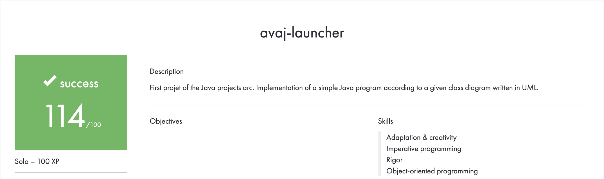

# AVAJ LAUNCHER

## Prerequisites
* UML diagram interpretation skills
* Java

## Description
Implementing a Java program according to a given class diagram written in UML.

## Overall Achievements


## File Structure
```
avaj_launcher
│
│   Makefile
│   README.md
│   scenario.txt
│   
└───docs
│
│   avaj_uml.jpg
│   avaj-launcher.en.pdf
│   overview.png
│
└───simulator
│   │
│   └───aircrafts
│       
│       Aircraft.java
│       AircraftFactory.java
│       Baloon.java
│       Flyable.java
│       Helicopter.java
│       JetPlane.java│
│   
│   CustomException.java
│   Logger.java
│   Main.java
│   Tower.java
│   WeatherTower.java
│
└───weather

    Coordinates.java
    WeatherProvider.java
```
## Compiling and Executing
To compile use the following command line
```
make all
```
To execute the simulator use the following command line
```
java simulator.Main scenario.txt
```
This will output a text file named "simulation.txt", which we will then display using the following command line
```
cat -e simulation.txt
```
To clean up the repo use the following command line
```
make clean
```